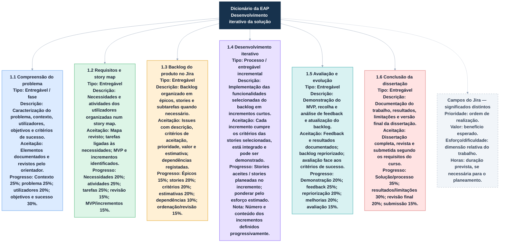

# Dicionário da EAP — Desenvolvimento iterativo

```mermaid
%%{init: {"theme":"base","themeVariables":{"fontFamily":"Arial, sans-serif","primaryTextColor":"#172033","lineColor":"#94A3B8","clusterBkg":"#F8FAFC","clusterBorder":"#CBD5E1"}}}%%
flowchart TB
    P["<b>Dicionário da EAP</b><br/>Desenvolvimento iterativo da solução"]

    P --> A["<b>1.1 Compreensão do problema</b><br/><b>Tipo:</b> Entregável / fase<br/><b>Descrição:</b> Caracterização do problema, contexto, utilizadores, objetivos e critérios de sucesso.<br/><b>Aceitação:</b> Elementos documentados e revistos pelo orientador.<br/><b>Progresso:</b> Contexto 25%; problema 25%; utilizadores 20%; objetivos e sucesso 30%."]
    P --> B["<b>1.2 Requisitos e story map</b><br/><b>Tipo:</b> Entregável<br/><b>Descrição:</b> Necessidades e atividades dos utilizadores organizadas num story map.<br/><b>Aceitação:</b> Mapa revisto; tarefas ligadas às necessidades; MVP e incrementos identificados.<br/><b>Progresso:</b> Necessidades 20%; atividades 25%; tarefas 25%; revisão 15%; MVP/incrementos 15%."]
    P --> C["<b>1.3 Backlog do produto no Jira</b><br/><b>Tipo:</b> Entregável<br/><b>Descrição:</b> Backlog organizado em épicos, stories e subtarefas quando necessário.<br/><b>Aceitação:</b> Issues com descrição, critérios de aceitação, prioridade, valor e estimativa; dependências registadas.<br/><b>Progresso:</b> Épicos 15%; stories 20%; critérios 20%; estimativas 20%; dependências 10%; ordenação/revisão 15%."]
    P --> D["<b>1.4 Desenvolvimento iterativo</b><br/><b>Tipo:</b> Processo / entregável incremental<br/><b>Descrição:</b> Implementação das funcionalidades selecionadas do backlog em incrementos curtos.<br/><b>Aceitação:</b> Cada incremento cumpre os critérios das stories selecionadas, está integrado e pode ser demonstrado.<br/><b>Progresso:</b> Stories aceites / stories planeadas no incremento; ponderar pelo esforço estimado.<br/><b>Nota:</b> Número e conteúdo dos incrementos definidos progressivamente."]
    P --> E["<b>1.5 Avaliação e evolução</b><br/><b>Tipo:</b> Entregável<br/><b>Descrição:</b> Demonstração do MVP, recolha e análise de feedback e atualização do backlog.<br/><b>Aceitação:</b> Feedback e resultados documentados; backlog repriorizado; avaliação face aos critérios de sucesso.<br/><b>Progresso:</b> Demonstração 20%; feedback 25%; repriorização 20%; melhorias 20%; avaliação 15%."]
    P --> F["<b>1.6 Conclusão da dissertação</b><br/><b>Tipo:</b> Entregável<br/><b>Descrição:</b> Documentação do trabalho, resultados, limitações e versão final da dissertação.<br/><b>Aceitação:</b> Dissertação completa, revista e submetida segundo os requisitos do curso.<br/><b>Progresso:</b> Solução/processo 35%; resultados/limitações 30%; revisão final 20%; submissão 15%."]

    N["<b>Campos do Jira — significados distintos</b><br/>Prioridade: ordem de realização.<br/>Valor: benefício esperado.<br/>Esforço/dificuldade: dimensão relativa do trabalho.<br/>Horas: duração prevista, se necessária para o planeamento."]
    P -.-> N

    classDef root fill:#17324D,color:#FFFFFF,stroke:#17324D,stroke-width:3px,font-size:19px,font-weight:bold;
    classDef analysis fill:#DCEBFF,color:#172033,stroke:#8BB8F0,stroke-width:2px;
    classDef mapping fill:#DDF5E7,color:#172033,stroke:#79C99A,stroke-width:2px;
    classDef backlog fill:#FFF0D5,color:#172033,stroke:#E9B958,stroke-width:2px;
    classDef build fill:#E9E1FF,color:#172033,stroke:#A78BFA,stroke-width:2px;
    classDef review fill:#D9F2F2,color:#172033,stroke:#67BFC0,stroke-width:2px;
    classDef closeout fill:#FFE3E3,color:#172033,stroke:#E69A9A,stroke-width:2px;
    classDef note fill:#F1F5F9,color:#334155,stroke:#94A3B8,stroke-dasharray:5 5;

    class P root;
    class A analysis;
    class B mapping;
    class C backlog;
    class D build;
    class E review;
    class F closeout;
    class N note;
```
